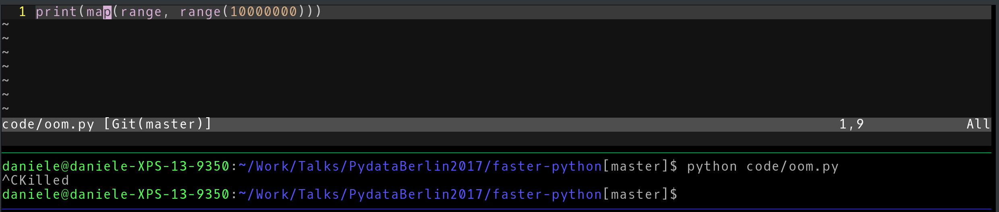
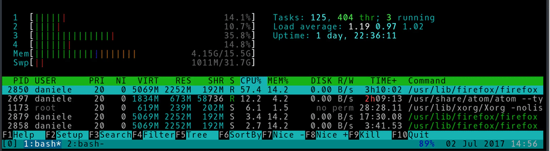

Engage the Hyper-Python
=======================

A rattle-through many of the ways to make your Python program faster
--------------------------------------------------------------------
---

Daniele Rapati
--------------

[notonthehighstreet.com](https://www.notonthehighstreet.com/pages/careers-page)

[github](https://github.com/danielerapati)

---

[gitpitch.com/danielerapati/faster-python](https://gitpitch.com/danielerapati/faster-python)

---
Slow is boring
--------------

Note:
short attention span

---
| Bottleneck / Solution | CPU | RAM | Disk | Network |
| --------------------- | --- | --- | ---- | ------- |
| Threads               |  <span style="color:#ff0000" >x</span>  |  <span style="color:#ff0000" >x</span> | <span style="color:#00ff44" >V</span>  | <span style="color:#00ff44" >V</span>       |
| Processes             |  <span style="color:#11dd44" >v</span>  | <span style="color:#ff0000" >x</span>  |   <span style="color:#00ff44" >V</span>  | <span style="color:#00ff44" >V</span> |
| Async                 |  <span style="color:#ff0000" >x</span>  |  <span style="color:#ff0000" >x</span>  |   <span style="color:#00ff44" >V</span>  | <span style="color:#00ff44" >V</span>       |
| Pypy                  |__<span style="color:#00ff11" >V</span>__| <span style="color:#ff0000" >x!!</span> |  <span style="color:#ff0000" >x</span>  | <span style="color:#ff0000" >x</span>   |
| Cython                |__<span style="color:#00ff11" >V</span>__|  <span style="color:#ff0000" >x</span> |  <span style="color:#ff0000" >x</span> | <span style="color:#ff0000" >x</span>  |

Note:
We are going to build up to this table ...

The magic table of "not so slow anymore"

This is not the whole truth but it can guide you most of the times.

Helpful heuristics ... there I said a difficult word.

<----- the table really should be an image, it should look good

---

Why slow?
---------

+++

Limited resources
-----------------
What happens when you use up a resource?

+++

CPU
------
you go slow

Note: operations queue up

+++

RAM
-----
out of memory error



+++

Disk
----
I/O is slow

do you wait while reading/writing?

Note: you can run out of disk and that would give you another error

a more frequent problem is using up all the I/O bandwidth

when we wait we say we are "blocking" because you block the flow of the program

+++

Network
-------
is super slow (bandwidth)

do you wait for response?

Note:
network operations can be even slower: what is the API you are calling doing on their end?

---

How to tell why
---------------

- know your program
- know it better: log
- know it even better: profile

+++

How to tell why: the easy way
-----------------------------

use a system monitor


(disclaimer: will not always work)

Note: my favorite is `htop`

---

What can you do?
----------------

- parallelize: threads, processes and beyond
- async
- alternative interpreter (pypy)
- push to C (Cython, etc.)

Note: you have already removed any obvious inefficiencies, i.e. you are not doing any slow operations that you know you could skip

---

The magic table of "not so slow anymore"
----------------------------------------
| Bottleneck / Solution | CPU | RAM | Disk | Network |
| --------------------- | --- | --- | ---- | ------- |
| Threads               |  <span style="color:#ff0000" >x</span>  |  <span style="color:#ff0000" >x</span> | <span style="color:#00ff44" >V</span>  | <span style="color:#00ff44" >V</span>       |
| Processes             |  <span style="color:#11dd44" >v</span>  | <span style="color:#ff0000" >x</span>  |   <span style="color:#00ff44" >V</span>  | <span style="color:#00ff44" >V</span> |
| Async                 |  <span style="color:#ff0000" >x</span>  |  <span style="color:#ff0000" >x</span>  |   <span style="color:#00ff44" >V</span>  | <span style="color:#00ff44" >V</span>       |
| Pypy                  |__<span style="color:#00ff11" >V</span>__| <span style="color:#ff0000" >x!!</span> |  <span style="color:#ff0000" >x</span>  | <span style="color:#ff0000" >x</span>   |
| Cython                |__<span style="color:#00ff11" >V</span>__|  <span style="color:#ff0000" >x</span> |  <span style="color:#ff0000" >x</span> | <span style="color:#ff0000" >x</span>  |

---

Concurrency and Parallelization
-------------------------------

Ideal situation: outputs that do not require previous outputs


Note:
difficult words

concurrent  = multiple operations at the same time

parallel = you can run as many operations at the same time as you want / can

if we can run more than one thing at a time it means we don't hae to wait

+++

Parallel
--------
```python
def where(city):
  r = requests.get(
      'https://maps.googleapis.com/maps/api/geocode/json',
      params={"address": city}
  ).content
  return json.loads(r)['results'][0]['geometry']['location']

[where(thing) for thing in
  ['London', 'Berlin', 'Milan',
   'my plane ticket', 'my keys']]
```

Note:
don't need to wait

+++

Sequential
----------
```python
def fib(n):
  if n in [0,1]: return n
  else: return fib(n-1) + fib(n-2)

def fib_for(n):
  a,b = 0,1
  for i in range(n):
    a,b = b, a + b
  return a

fib_for(200)
```

---

Threads
-------

```python
#ideally

from multiprocessing.pool import ThreadPool

outputs = ThreadPool().map(operate, inputs)
```

Note:
avoid waiting for disk and network using threads

if we can parallelize

otherwise you can manually create Threads you need,
override `.run()` and `.start()` them

+++

Threads: how do they work?
--------------------------
independent subset of program

implementation depends on OS

shared memory

shared interpreter

+++

Threads: limitations
--------------------
- manual synchronization of variable values can be messy
- shared interpreter with GIL has performance overhead

Note: writing to shared variables may requires locks

wait wait wait: I know that Threads can use only 1 CPU ...
well it depends on the operating system: the interpreter is a single process so it runs on only one cpu
but linux can run the single threads on different cpus, still limited by the interpreter

+++
Threads
-------

| Bottleneck / Solution | CPU | RAM | Disk | Network |
| --------------------- | --- | --- | ---- | ------- |
| Threads               |  <span style="color:#ff0000" >x</span>  |  <span style="color:#ff0000" >x</span> | <span style="color:#00ff44" >V</span>  | <span style="color:#00ff44" >V</span>       |

---

Processes
---------

```python
from multiprocess import Pool

outputs = Pool().map(operate, inputs)
```

Note:
avoid waiting for disk and network and use all your cpus with processes

+++

Processes: how do they work?
----------------------------

spawns new python interpreters (new OS process)

implementation depends on OS

Note:
you can think of processes as the bigger cousin of threads

`os.fork()` vs serialized input / output with pickle

+++

Processes: limitations
----------------------

- startup time
- memory footprint
- no shared memory*

Note: actually you can safely share memory with `multiprocessing.Value`, `multiprocessing.Array` and `sharedctypes`

+++

Processes: watch out for
------------------------

- make your code importable
```python
if __name__ == '__main__':
  # create and use the Pool here
```
- avoid shared stateful objects (e.g. db connections)

+++
Processes
---------

| Bottleneck / Solution | CPU | RAM | Disk | Network |
| --------------------- | --- | --- | ---- | ------- |
| Processes             |  <span style="color:#11dd44" >v</span>  | <span style="color:#ff0000" >x</span>  |   <span style="color:#00ff44" >V</span>  | <span style="color:#00ff44" >V</span> |

---

Concurrency: Celery
-------------------

`pip install -U celery`

- many workers
- shared task queue (Redis, RabbitMQ, SQS, a DB ...)

Note:
a framework = more power + simpler life - you need to learn it

+++

Concurrency: Celery
-------------------

multiple machines

---

Async
-----
```python
import asyncio

async def operate(thing):
  res = await slow_async_operation(thing)
  return res

loop = asyncio.get_event_loop()

tasks = [loop.create_task(where(thing)) for thing in inputs]

loop.run_until_complete(asyncio.gather(*tasks))
```

Note:
the "not so new anymore" hot new thing

Tornado and Twisted are older frameworks for asynchronous programming that work in python2 as well

+++

Async: how it works
-------------------


Note:
have you ever programmed a simple videogame? maybe with pygame?

basically you have a loop always running and you attach tasks, called "coroutines", to that loop

the loop checks each coroutine for new events

when there is an event then you react and execute code, return values or start waiting for a new event

and move on to checking the other tasks attached to the loop

+++

Async: benefits
---------------

can handle much more concurrent tasks than with Threads

Note:
if you are calling APIs you really want to use async

or if you developing a web server

+++

Async: Limitations
------------------

- use async versions of common sync operations / libraries
- explicit exception handling
- use semaphores to limit concurrency

+++

Async
-----

| Bottleneck / Solution | CPU | RAM | Disk | Network |
| --------------------- | --- | --- | ---- | ------- |
| Async                 |  <span style="color:#ff0000" >x</span>  |  <span style="color:#ff0000" >x</span>  |   <span style="color:#00ff44" >V</span>  | <span style="color:#00ff44" >V</span>       |

---

Pypy
----

use instead of calling `python`

`pip install pypy`

Note:
Python is a fantastic language but an interpreted language

a compiled language such as C would execute the same operations much faster

main attractive is you may not need to change your code at all

+++

Pypy: how it works
------------------

Just In Time compilation

Note:
the interpreter itself is in `RPython`, "Restricted Python"

the interpreter can decide to compile instructions "on the fly"

most benefits in long running programs
+++

Pypy: Limitations
-----------------
- python2 (3 is in beta)
- not all libraries will work
- tuning of parameters / RAM usage

Note:
for now to use Numpy you need a specific fork of Numpy written by the Pypy community

+++

Pypy
----

| Bottleneck / Solution | CPU | RAM | Disk | Network |
| --------------------- | --- | --- | ---- | ------- |
| Pypy                  |__<span style="color:#00ff11" >V</span>__| <span style="color:#ff0000" >x!!</span> |  <span style="color:#ff0000" >x</span>  | <span style="color:#ff0000" >x</span>   |

---

Push execution to C
-------------------

[C extensions](https://docs.python.org/3/extending/extending.html)

Note:
can we go all the way and just compile our program?

after all CPython is written in C, you can extend it with C code

but it means rewriting some parts of your program in C

---

Cython
------

`pip install cython`

call with `cython`

Note:
a lighter weight solution for compiling

massive speedup

support for parallelizing operations

+++

Cython: usage
-------------

- define function: `cdef` or `cpdef`

- add static types


Note:
I could just add a few annotations to the most cpu expensive parts of my code

profiling is useful

+++

Cython
------

| Bottleneck / Solution | CPU | RAM | Disk | Network |
| --------------------- | --- | --- | ---- | ------- |
| Cython                |__<span style="color:#00ff11" >V</span>__|  <span style="color:#ff0000" >x</span> |  <span style="color:#ff0000" >x</span> | <span style="color:#ff0000" >x</span>  |

---

The magic table of "not so slow anymore"
----------------------------------------
| Bottleneck / Solution | CPU | RAM | Disk | Network |
| --------------------- | --- | --- | ---- | ------- |
| Threads               |  <span style="color:#ff0000" >x</span>  |  <span style="color:#ff0000" >x</span> | <span style="color:#00ff44" >V</span>  | <span style="color:#00ff44" >V</span>       |
| Processes             |  <span style="color:#11dd44" >v</span>  | <span style="color:#ff0000" >x</span>  |   <span style="color:#00ff44" >V</span>  | <span style="color:#00ff44" >V</span> |
| Async                 |  <span style="color:#ff0000" >x</span>  |  <span style="color:#ff0000" >x</span>  |   <span style="color:#00ff44" >V</span>  | <span style="color:#00ff44" >V</span>       |
| Pypy                  |__<span style="color:#00ff11" >V</span>__| <span style="color:#ff0000" >x!!</span> |  <span style="color:#ff0000" >x</span>  | <span style="color:#ff0000" >x</span>   |
| Cython                |__<span style="color:#00ff11" >V</span>__|  <span style="color:#ff0000" >x</span> |  <span style="color:#ff0000" >x</span> | <span style="color:#ff0000" >x</span>  |

---

Daniele Rapati
--------------

[notonthehighstreet.com](https://www.notonthehighstreet.com/pages/careers-page)

[github](https://github.com/danielerapati)

---

Bonus
------

---
Threads can use more than 1 CPU
-------------------------------

<--- and here there is an animated gif proving it
---

trade-offs: caching in memory
-----------------------------

use RAM instead of CPU

```python
cache = {}
def fib(n):
  if n not in cache:
    if n in [0,1]: cache[n] = n
    else: cache[n] = fib(n-1) + fib(n-2)

  return cache[n]

fib(200)
```

Note:
"have you ever played Settlers of Catan?"

you can generalize this pattern as `memoize`

+++

trade-offs: caching in memory 2
-------------------------------

cache information that you retrieve from network or disk

+++

trade-offs: ram and disk
------------------------

OS: ram-disks vs swap

Python: mmap

---

Async: full example
-------------------
```python
import asyncio
import aiohttp
import json

async def where(city):
  async with aiohttp.ClientSession() as session:
    r = await session.get(
      'https://maps.googleapis.com/maps/api/geocode/json',
      params={"address": city})
    c = await r.text()
    return json.loads(c)['results'][0]['geometry']['location']

inputs = ['London', 'Berlin', 'Milan',
          'my plane ticket', 'my keys']

loop = asyncio.get_event_loop()
tasks = [loop.create_task(where(thing)) for thing in inputs]
loop.run_until_complete(asyncio.gather(*tasks))
```
